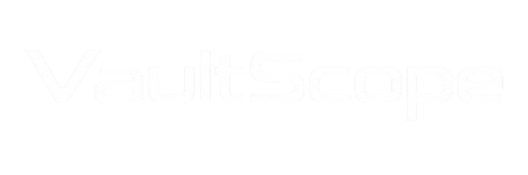

**Beyond Today. Built For What’s Next.**

Infrastructure & hosting for developers, teams, and businesses.

 

---

## ☁️ Infrastructure

We are building a modern hosting platform around reliable, open-source infrastructure.

<table>
<tr>
<td align="center" width="250">

### ☁️ Cloud VPS

Flexible virtual infrastructure for applications, services, development, and more.

</td>
<td align="center" width="250">

### 🖥️ Dedicated Servers

Bare-metal infrastructure for workloads that need maximum performance and control.

</td>
<td align="center" width="250">

### ⚙️ Infrastructure

Automation, monitoring, deployment, and tooling powering the platform.

</td>
</tr>
</table>

---

## 🧩 Our Stack

 

---

## 🛠️ Open Source

We use open-source software extensively throughout our infrastructure and actively build tooling around it.

Our repositories cover areas such as:

* Infrastructure
* Automation
* Monitoring
* Developer tooling
* Hosting
* Internal platform components

> **Transparency matters.** We want to show what powers VaultScope instead of hiding the infrastructure behind a black box.

---

### 🚀 Building the infrastructure behind what comes next.

**[Website](https://vaultscope.de) · [Open Source](https://vaultscope.de/open-source) · [Repositories](https://github.com/VaultScope)**

 

